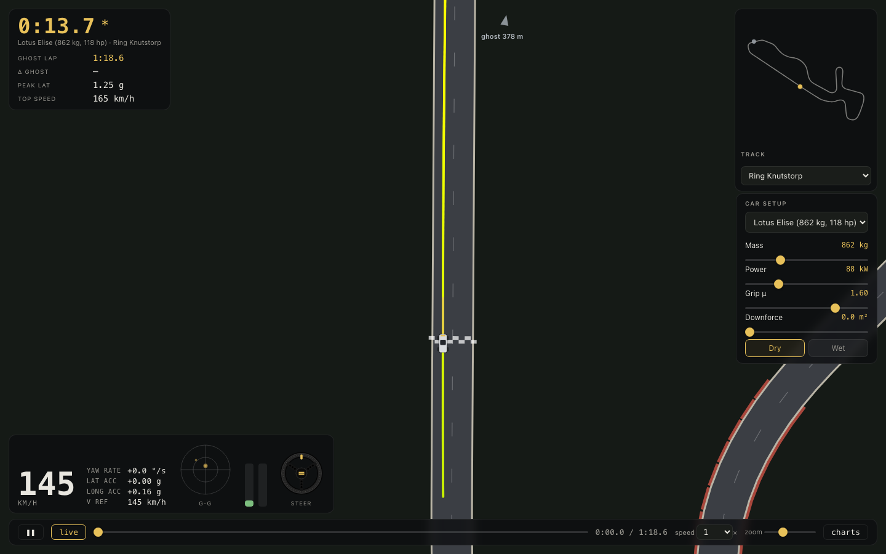
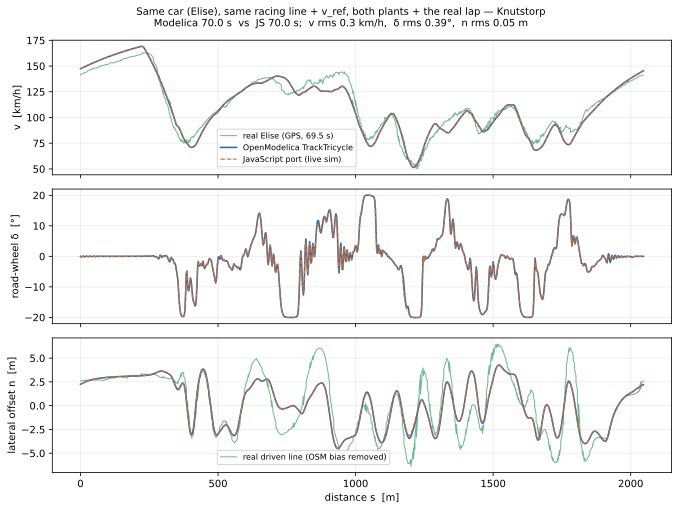
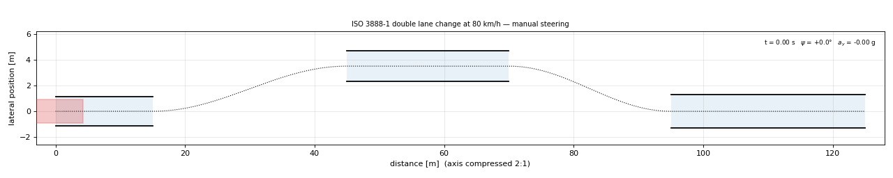
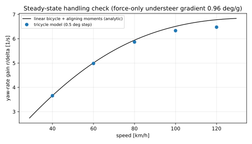

# kerbhopping


A **live track-driving simulator** built on a minimal, defensible **planar vehicle
model**: per circuit a **minimum-time racing line** (CasADi/IPOPT optimal control) that you
can watch, race and re-tune in your browser, with the headline cars **calibrated against
real GPS+IMU lap telemetry** from Ring Knutstorp. The physics is a faithful JavaScript port
of an OpenModelica model. The project began as a study of steering-rack forces in an
ISO 3888-1 double lane change — that study lives on further down, and its plant is where
the "tricycle" got its name.

## Live simulator

**→ [pfyhr.github.io/kerbhopping](https://pfyhr.github.io/kerbhopping/)** — runs in the
browser, nothing to install.



The same 3-DOF plant, lookahead driver and quasi-steady speed profile, ported to JavaScript:
a full lap solves in a few milliseconds, so there is no backend and nothing to wait for. It
opens in **real-time driving** — the car laps the circuit under the live physics, and the
sliders (mass, power, grip μ, downforce, dry/wet) take effect **from wherever the car is right
now**, no re-solve and no jump back to the line. A translucent **baseline "ghost"** of the car
as it was before you started tuning laps alongside for comparison: drawn on the track when it
is near, always a second dot on the minimap, and an edge arrow with the gap in metres when it
is off-camera. The lap time shown is the **actual** time the car records crossing start/finish
(marked `*` while you are mid-adjustment — let it complete one clean lap for a representative
time). A dropdown switches between the five circuits; the chase-camera follow view carries a
speed / g-g / steering / sideslip HUD, and a **replay** toggle drops back to a scrubbable
pre-solved lap. **Drive** hands you the wheel — arrow keys or WASD on desktop, touch-drag on
a phone — racing the AI ghost under the same physics, and **⟲ restart** launches you and the
ghost together from the line with whatever car you have built on the sliders.

`build_webgui.py` bakes each circuit's minimum-time OCP racing line and geometry into a single
self-contained `outputs/index.html`, published to GitHub Pages on every push to `main`.

## The vehicle model (what actually runs in your browser)

Everything below lives in `webgui_template.html` as ~120 lines of physics — a faithful port
of the Modelica `Track.TrackTricycle` plant (see the next section for its origin), integrated
with fixed-step **RK4 at dt = 6 ms**. A full lap is ~12 000 steps and solves in a few
milliseconds, which is what makes live re-tuning and real-time driving free.

### Plant: 9 states, three wheels

The chassis is a planar two-track-front / lumped-rear **"tricycle"** in track (Frenet)
coordinates. State vector:

| # | State | Meaning |
|--:|---|---|
| 1 | `s` | distance along the centerline |
| 2 | `n` | lateral offset from the centerline |
| 3 | `Δψ` | heading error to the centerline tangent |
| 4 | `u` | longitudinal (body) speed |
| 5 | `v_y` | lateral (body) speed |
| 6 | `r` | yaw rate |
| 7 | `δ` | actual road-wheel steer (first-order actuator, τ = 0.10 s) |
| 8 | `ΔF_z` | lateral load transfer across the front axle (roll-mode lag, τ = 0.15 s) |
| 9 | `ΔF_zx` | longitudinal load transfer (pitch-mode lag, τ = 0.20 s) |

Path kinematics couple the chassis to the road: `ṡ = (u·cosΔψ − v_y·sinΔψ)/(1 − n·κ)` and
`Δψ̇ = r − κ·ṡ`, with κ the local centerline curvature. The two front wheels carry their own
slip angles (they differ by the yaw-rate term `± r·t_f/2` in the velocity at each contact
patch), their own normal loads, and their own aligning moments — which is why lateral load
transfer genuinely costs front grip and the car pushes when loaded. The rear axle is one
lumped wheel.

### Tyres: analytic brush model

Each wheel runs the classic **brush** tyre model — the physical bristle picture that was
the standard before empirical fits took over (Svendenius 2003 has the lineage; the analytic
form here follows Pacejka, Tyre and Vehicle Dynamics ch. 3) — smooth, event-free and cheap:

- cornering stiffness with degressive load sensitivity: `C_α(F_z) = c1·sin(2·atan(F_z/c2))` —
  doubling the load less-than-doubles the stiffness, so transferring load across an axle
  always loses net grip;
- lateral force `F_y = µF_z·(1 − λ³)·sgn(α)` where `λ` collapses from 1 to 0 as the slip
  approaches the friction limit (`θ = C_α/(3µF_z)`);
- aligning moment from a pneumatic trail `a_p(F_z) = a_p0·√(F_z/F_znom)` that collapses to
  zero at the limit — the steering "goes light" exactly when the front axle saturates.

Longitudinal force is allocated *after* lateral: the drive/brake demand is clipped per axle by
the **friction-ellipse remainder** `√((µF_z)² − F_y²)` — an idealized TC/ABS. Drive is
rear-only and additionally capped by engine power `P/u`; brakes split `kBf` to the front axle.

### Loads and aero

Static axle loads from the weight split; downforce `F_down = ½ρ·C_lA·u²` divided by `aeroBal`
front/rear (the Clubman carries C_lA = 0.5 m²; sliders let you give any car up to 5 m²). The
two load-transfer states relax toward `ξ_F·m·a_y·h/t_f` (front share of the roll couple) and
`m·a_x·h/L` with their respective time constants — so a snap of steering or brakes takes
~0.15–0.2 s to fully load the outside/front tyres, exactly the transient that punishes
"stab-the-pedal" inputs.

### The driver: two channels, calibrated against real laps

**Steering** is the Kapania–Gerdes lookahead law: a feedforward
`(L + K_us·u²)·κ_line` evaluated a preview time ahead, **plus the OCP line's own optimal
steer** passed through as a dynamic feedforward, minus lookahead-error feedback
`K_LA·e_LA` with `e_LA = (n − n_ref) + x_LA·(Δψ − ψ_ref)` — the path error a distance
`x_LA = 5 m + 0.25·u` ahead (capped at u = 38 m/s). The feedback gain rolls off above a
speed knee (u ≈ 43 m/s) — quick hands don't work at 200 km/h, and without the rolloff the
wheel saws on fast straights. A yaw-damping term `K_r·(r − κ·u)` and a `tanh` saturation at
the 20° steering stop close the loop; the command then passes through the 0.10 s actuator.

**Pedals** follow the reference speed with a ~1 s preview, but braking for a corner beyond
the preview is an **onset trigger, not a plan**: the far horizon watches the kinematic
deceleration needed for every point ~2 s ahead, and only when that need reaches ~0.4 µg does
the driver commit — then brakes ~25 % *harder* than kinematically necessary, trailing off as
the planned path curvature claims its share of the friction circle. This late-hard shape came
straight from the logged laps (real braking p90 = 0.90 g; an earlier spread-out horizon
never exceeded 0.6 g and gave laps 5 s too slow). Symmetrically, the throttle gets no more
than the friction-circle remainder of the *worse* of planned curvature and measured `|r|·u` —
no full power until the car is unwound, which is what keeps corner-exit power-on understeer
from running the car wide. Where the steering gain has rolled off, the driver also carries a
few percent of speed margin (slow hands need slack).

### Speed reference and racing line

The reference `v_ref(s)` is the classic quasi-steady profile on the racing line: corner-speed
limit from the lateral budget (growing with downforce as `a_y,cap = a_yF·(1 + ρC_lA·v²/2mg)`),
then a power/traction-limited forward pass and a braking-limited backward pass, both shaped
by the friction ellipse.

The **line itself** is a genuine minimum-time trajectory: per track, a 3-DOF min-time OCP
(CasADi + IPOPT, direct collocation — details in the OCP section below) solved once for the
calibrated Elise and baked into the page as `n_ref / ψ_ref / κ_line / δ_FF` tables. The
corridor lets the line put the car's edge at the white line; a small speed-scaled driver
margin (larger only on the Nordschleife's 200 km/h kinks) absorbs the lookahead driver's
overshoot so the apexes land **on the kerbs**, not the grass — matching the logged laps,
which run 20–25 m shorter than the centerline because real drivers cut over them.

### Calibrated against real telemetry

The headline presets are fitted to the owner's RaceChrono/VBOX logs (`tracks/racelogs.py`
parses whole sessions and splits laps; the committed overlay traces are in
`tracks/telemetry/`). Fit inputs: speed-vs-distance of the best real laps at Ring Knutstorp,
lap time, sustained lateral g, and braking rate. Mass and power were **not** fitted — they
are the known car specs; the fit adjusted tyre µ and the used lateral budget.

| | real (logged) | simulated |
|---|--:|--:|
| Lotus Elise best lap, Knutstorp | **1:09.5** | 1:10.1 |
| Mazda MX-5 best lap, Knutstorp | **1:08.0** | 1:09.1 |
| sustained lateral (p99) | 1.62 / 1.67 g | ~1.5 g |
| braking (p90) | 0.90 g | ~0.7 g |
| top speed on track | 163 / 167 km/h | 169 / 173 km/h |
| speed-trace error v(s), rms | — | 9.2 km/h |

The remaining ~0.5-1 s sits in the line model, not the car: the sim's track has no kerbs to cut
and its driver keeps a small tracking margin a professional would not. The four cars:

| Preset | m | P | µ | provenance |
|---|--:|--:|--:|---|
| Lotus Elise | 862 kg | 88 kW | 1.80 | fitted to the owner's logged laps |
| Mazda MX-5 "Oskar" | 980 kg | 104 kW | 1.82 | fitted to Oskar's logged lap 19 |
| BMW M140i | 1530 kg | 250 kW | 1.30 | spec-based; µ matches its logged 1.28 g |
| Clubman Racer | 580 kg | 116 kW | 1.75 | Swedish Clubman class figures, slicks + wing |

When you **drive yourself** (arrow keys / WASD / touch), the same plant runs with your
steer and pedal inputs replacing the driver law — plus a soft-ground penalty (rolling drag
up, grip trimmed) once you put wheels past the white line.

### Is the port faithful?

Claim tested, not assumed: `port_validation.py` takes the baked Knutstorp tables and the
Elise's reference speed straight out of the built page, laps the **OpenModelica**
`TrackTricycle` on them, and laps the **JavaScript** plant on the identical inputs. The
driver is ONE law in both plants — the telemetry-calibrated steering (lookahead cap,
high-speed gain knee) and pedals (late-hard brake commit, friction-circle shares,
hold-speed-to-the-braking-point) were developed in the JS against the live sim and
telemetry, then backported to the Modelica `TrackDriver`; the track plant runs
relaxation-free by default to match the port (a `relaxOn` switch restores it — with it
on, the same driver gains ring at high speed, which is how the two loop dynamics were
shown to agree in the first place).



Lap time **70.0 s vs 70.0 s (Δ0.1 s)**; over the full lap the speed traces agree to
**0.3 km/h rms**, the road-wheel steer to **0.39° rms**, and the driven line to
**0.05 m rms** — the two curves are indistinguishable at plot scale.

The third trace is the **real lap** (69.5 s): the logged GPS is rigidly fitted onto the
track frame (the driven lap *is* the track, so three closest-point Procrustes rounds
recover the projection), giving the real speed *and the real driven line* on the same
s-axis. The real speed matches the sims corner-for-corner — and shows exactly where the
sim line is still conservative (the fast left at s ≈ 950 where the real driver carries
~15 km/h more). The real line swings the same apex pattern with slightly more amplitude
(kerbs). One honest footnote: the fit also *measures* the OSM centerline's own lateral
error — a slowly varying **~3 m mean bias (10 m worst)** that the whole track frame
inherits; it is removed (100 m high-pass, labeled) before the line comparison, and it
means the logged laps could eventually be used to *correct* the track geometry itself.

## Track sim: minimum-time laps of planar circuits

The `Tricycle.Track` sub-package re-expresses the tricycle in **track (Frenet)
coordinates** (s, n, Δψ) and adds a **longitudinal degree of freedom**: rear-wheel
drive limited by engine power (P_max/u) and by the rear friction-ellipse remainder
√((μF_z)² − F_y²), brakes split front/rear under the same per-axle ellipse limit
("ideal TC/ABS"), aero drag, rolling resistance, and pitch-lagged longitudinal load
transfer. Centerlines come from OpenStreetMap (elevation dropped — planar by design;
© OpenStreetMap contributors, ODbL), smoothed and tabulated as κ(s) in
`tracks/<key>.csv`.

The driver follows a **racing line**, not the centerline. For a track corridor of
half-width w (from the track width minus the car and a margin), the
minimum-curvature line — the offset profile n_ref(s) that flattens the corners as
much as the asphalt allows — is computed by a fast regularized solve
(`tracks/racing_line.py`; Braghin et al. 2008, Heilmeier et al. 2020). The
quasi-steady minimum-time speed profile v_ref(s) is then recomputed *on that faster
line* (corner-speed limit → power/traction-limited forward pass → braking-limited
backward pass), and the two-channel `TrackDriver` tracks it. Steering is a
feedforward–feedback law (Kapania & Gerdes 2015): a steer feedforward (line curvature
with an understeer term, plus the OCP line's dynamic steer where available) plus
**lookahead-error feedback** — the path error e_la = (n − n_ref) + x_LA·(Δψ − ψ_ref)
evaluated a speed-scaled distance x_LA = x_LA0 + T_LA·v ahead, whose built-in phase
lead lets one fixed gain hold the line to the grip limit without gain-scheduling —
with yaw-rate damping. Throttle/brake is a preview-consistent constant-acceleration
law. Setting the corridor to zero recovers exact centerline following, so the same
driver does both (`track_lap.py --line=center`).

This is a genuine racing line — wide entry, apex, track-out — but the
minimum-curvature line for a fixed corridor, *not* a provably minimum-time trajectory
(see "How optimal is it?" below).

Lap times for the telemetry-calibrated Elise (862 kg / 88 kW / µ = 1.80,
`--car=elise`), racing line vs. centerline following:

| Track (`--track=`) | Length | Racing line | Centerline | v_max |
|---|--:|--:|--:|--:|
| `nordschleife` — Nürburgring Nordschleife | 20.72 km | **8:48.4** | 9:20.7 | 202 km/h |
| `anderstorp` — Anderstorp Raceway | 4.01 km | **1:54.9** | 1:59.9 | 189 km/h |
| `gelleras` — Gelleråsen Arena (Karlskoga) | 2.33 km | **1:17.6** | 1:23.5 | 173 km/h |
| `knutstorp` — Ring Knutstorp | 2.06 km | **1:11.5** | 1:17.1 | 169 km/h |
| `kinnekulle` — Kinnekulle Ring | 2.06 km | **1:02.1** | 1:05.6 | 170 km/h |

The racing line is 4–7 % quicker, and the car tracks it to within ~1.2 m rms.
(These are the geometric min-curvature lines; the live simulator runs the OCP
min-time lines below, which is why its Knutstorp lap is a second faster still.)


```
python3 tracks/fetch_track.py --track=all         # (re)build centerlines from OSM - needs network
python3 track_lap.py    --track=knutstorp         # racing line + speed profile + lap sim + figures
python3 track_lap.py    --track=knutstorp --line=center   # centerline following, for comparison
python3 track_render.py --track=knutstorp         # chase-camera HTML viewer (outputs/<key>_chase.html):
                                                  # GTA-style follow cam, minimap, speed/yaw/accel HUD
python3 build_webgui.py                           # build the live browser simulator (outputs/index.html):
                                                  # JS port of plant+driver, all five tracks, live tuning
python3 port_validation.py                        # faithfulness check: Modelica vs JS, same car+line
                                                  # (outputs/svg/port_validation.svg)
```

Adding a track is one entry in the `TRACKS` registry in `tracks/fetch_track.py`
(an OSM route relation, or a bounding box whose raceway ways are auto-assembled into
the closed circuit loop). Vehicle setup is sweepable: `track_lap.py` mirrors the
`Tricycle.Track.TrackTricycle` defaults, and per-run overrides pass straight through
to `simulate(..., simflags="-override Pmax=...")`.

### How optimal is it? (`--line=ocp`)

The default racing line is the minimum-*curvature* line — a good, standard geometric
approximation, but not a minimum-*time* one. For a genuine minimum-time line,
`track_lap.py --track=<key> --line=ocp` solves a **minimum-time optimal-control problem
for a 3-DOF planar vehicle** (`tracks/opt_lap.py`; the min-curvature line warm-starts it):

- states = offset n, heading error Δψ, and the full chassis (longitudinal u, lateral v,
  yaw rate r); controls = road-wheel steer and longitudinal acceleration; minimize ∫dt
  in the arc-length domain around the loop;
- subject to the curvilinear vehicle dynamics with **the same brush tyre as the plant**,
  the friction ellipse as an inequality F_x²+F_y² ≤ (μF_z)², the engine-power limit
  F_x·u ≤ P, quasi-static load transfer, and the track corridor;
- transcribed by direct collocation into one nonlinear program and solved with
  [CasADi](https://web.casadi.org/) + IPOPT (L-BFGS Hessian, ~30 s/track). The KKT
  conditions certify **local** optimality (nonconvex — no global guarantee).

This follows the standard minimum-lap-time formulation (Perantoni & Limebeer 2014; the
TUM `opt_mintime` work, Christ et al. 2021): a low-DOF chassis with realistic tyres and
the friction limit as a constraint. Unlike a point-mass model, it has **genuine yaw
inertia**, so the optimum is a proper wide-entry/apex/track-out line the real car can
actually hold — not a weaving trajectory that only a point mass could follow.

The full Modelica `TrackTricycle` then **drives** this line (the OCP chooses the line;
OpenModelica simulates the real car tracking it), realized by the lookahead-error driver
above. Two things make that tracking work: the OCP's own optimal steer is passed through
as a dynamic feedforward, and the corridor is **speed-dependent** — pulled in from the
edge where the car is fast (it runs wider on exit the faster it goes), so the aggressive
line stays on the asphalt.

Honest caveats:

1. **Optimal for a reduced model.** The 3-DOF single-track OCP omits the left/right load
   transfer, tyre relaxation lag and steering actuator lag the full plant has — exactly
   what the plant adds back when it drives the line. `T_opt` is the 3-DOF optimum, a
   close lower estimate, not a bound on the full car.
2. **Local, not global.** IPOPT certifies a KKT point, not the absence of a better basin.
3. **It helps most where the corners are slow and tight.** On flowing high-speed tracks
   the minimum-curvature line is already close to time-optimal, so the OCP roughly ties
   it there; the gains come on technical circuits.

Result — driven laps (full model tracking each line), `T_opt` = the 3-DOF optimum:

| Track | Min-curvature | OCP-tracked | Δ | `T_opt` (3-DOF) |
|---|--:|--:|--:|--:|
| Knutstorp | 1:11.5 | **1:11.0** | −0.5 s | 1:04.9 |
| Gelleråsen | 1:17.6 | **1:17.0** | −0.6 s | 1:10.6 |
| Anderstorp | 1:54.9 | **1:52.8** | −2.1 s | 1:46.4 |
| Kinnekulle | 1:02.1 | **1:00.9** | −1.2 s | 0:56.8 |
| Nordschleife | 8:48.4 | 9:00.7 | +12.3 s | 8:01.3 |

(Elise, same setup as the table above.) The OCP line wins on every circuit except the
Nordschleife, where the aggressive min-time line through the 200 km/h sections outruns
what the driver can track through `track_lap`'s plain corridor — the live simulator
solves exactly this with per-track, lateral-demand-scaled driver margins, which is why
its Nordschleife laps use the OCP line and still stay on the kerbs. Tracked to
~1.0–1.3 m rms.

The OCP needs CasADi (`pip install casadi`, bundles IPOPT); `--line=optimal`
(min-curvature) remains the dependency-free default.

## Modelica origin: the double-lane-change study

`modelica/Tricycle.mo` (single-file Modelica package, simulated with OpenModelica):

- **`PlanarTricycle`** — planar three-wheel ("tricycle") vehicle: individual front
  wheels (own slip angles, quasi-static lateral load transfer with a roll-mode lag),
  lumped rear wheel — the architecture used for front-axle force estimation in
  WO 2025/113783 (Marzbanrad & Jonasson, Volvo). Chassis: 2 DOF (lateral velocity, yaw
  rate) at constant speed + path kinematics. Kingpin moment per side =
  Fy·(mechanical trail) − Mz; tie-rod force = M_kp/L_arm. `toeL`/`toeR` inputs are
  hooks for an active-toe actuator (wired to 0 here).
- **`TireData` / `brushForces`** — classic brush tire (analytic form after Pacejka,
  Tire and Vehicle Dynamics Ch. 3; see Svendenius 2003 for the model family): analytic Fy(α, Fz) and Mz(α, Fz) with a pneumatic trail that starts at
  a_p/3 ≈ 20 mm and collapses to zero at the grip limit; degressive load sensitivity;
  first-order relaxation lag. Smooth and event-free.
- **`ManualSteering`** — handwheel/column inertia + ideal pinion
  (r_p = L_arm/i_S, i_S = 20 typical for unassisted steering) + rack mass. No assist:
  the full kingpin reaction reflects to the handwheel, τ_HW = F_rack·r_p.
- **`Iso3888Path`** — ISO 3888-1 reference centerline (sections 15/30/25/25/15/15 m,
  3.5 m offset, 125 m total) + MacAdam-class single-point preview driver with yaw-rate
  damping. The driver turns the handwheel through a 2 Hz arm filter.
- **Examples** — `StepSteer` (understeer validation), `DoubleLaneChange` (headline,
  closed-loop at the ISO-recommended 80 km/h), `OpenLoopDLC` (prescribed one-period
  sine, repeatable sweeps).



*Closed-loop ISO 3888-1 double lane change at 80 km/h (real-time playback): vehicle
outline at true yaw with the running time, heading and lateral-acceleration readout.
The distance axis is compressed 2:1; gate compliance is checked on the true footprint.*

### DLC headline results (defaults: D-segment sedan, 80 km/h)

| Quantity | Value |
|---|---|
| ISO 3888-1 gates (full-footprint check) | PASS, margins +91/+68/+151 mm |
| Peak lateral acceleration | 0.76 g |
| Peak tie-rod force | ≈ 1.4 kN per side (left/right split by load transfer) |
| Peak kingpin moment | ≈ 150 N·m per wheel |
| Peak handwheel angle / torque | ≈ 110° / **10 N·m** (unassisted!) |
| Understeer gradient (tires-only) | 0.96 deg/g — low edge of the production band, as expected with compliance/roll steer omitted |

Note the driver tuning (Tp = 0.55 s, Kdrv = 0.22, Kr = 0.25) is deliberately slow and
well damped: the 2 Hz arm filter adds phase lag that the preview must compensate, and
tighter tunings destabilize the driver–steering loop — a genuine interaction, not a
numerical artifact.

### Run the Modelica pipeline

```
python3 dlc_maneuver.py      # simulations, figures (outputs/svg), animation (outputs/gif), summary CSV
python3 render_diagram.py    # component diagram from the OpenModelica instance
python3 tests/run_tests.py   # test suite (also runs in GitHub Actions on every push)
```

Requires OpenModelica (`omc` on PATH), Python 3 with numpy + matplotlib.
Everything sweepable (speed, driver, steering ratio, tire and chassis parameters) is a
top-level parameter of the examples, overridable per run via `-override=...`.

### DLC validation

- Steady-state yaw-rate gain matches the analytic linear bicycle *including aligning
  moments* to < 1 % across 40–120 km/h:

  

- A NumPy twin of the brush tire is asserted against the Modelica steady state to
  < 10⁻³ on every run of `dlc_maneuver.py`.
- Gate compliance is checked on the full yawed vehicle footprint (all four corners),
  matching the ISO "no cones displaced" intent.

## Sources

Parameter provenance and reference anchors in `sources/SOURCES.md`
(Pacejka, Heydinger SAE 1999-01-1336, ISO 3888-1:1999 incl. the recommended
(80 ± 3) km/h entry speed, Milliken, MacAdam, Reimpell, a measured DLC field test
[Bîndac et al. 2022], WO 2025/113783).

## Documented omissions

Constant speed; parallel steer (no Ackermann); no KPI/caster jacking; no scrub×Fx;
lumped rear tire (slightly understeer-optimistic; front link loads unaffected); no roll
DOF (roll-mode lag on load transfer instead); no steering column compliance or rack
friction; tire parameters are textbook-typical, not fitted to a specific tire.

## License

Released under the [MIT License](LICENSE).
